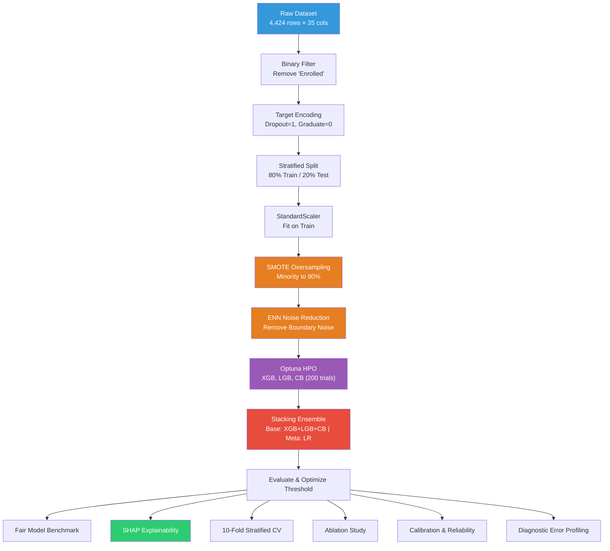

# PROJECT OVERVIEW — Student Dropout Prediction Pipeline

> **Title:** Early Student Dropout Prediction Using Stacking Ensemble, SMOTE-ENN, and SHAP Explainability  
> **Version:** V3 (Production-Ready Modular Pipeline & Extended Research Framework)  
> **Runtime:** Python 3.11+ (Local Environment & Jupyter Notebooks)

---

## 1. Project Objective

This is an **academic research project** in Educational Data Mining (EDM) aimed at building an Early Warning System (EWS) to identify higher education students at risk of dropping out before Semester 3. The core research questions are:

| ID | Research Question |
|----|-------------------|
| **RQ1** | Can an optimized multi-model pipeline combining resampling (SMOTE-ENN), hyperparameter tuning (Optuna), and ensemble learning (Stacking) outperform traditional baseline classifiers in predicting student dropout? |
| **RQ2** | Which academic, financial, and demographic factors contribute most significantly to student dropout risk, as revealed by SHAP explainability analysis? |

The practical goal is **early institutional intervention** — utilizing demographic, financial, and early academic performance data from Semesters 1 & 2 to enable academic counselors and administrators to act proactively before Semester 3.

---

## 2. Repository Structure

```
student-dropout-prediction-edm/
├── README.md                          # Project documentation & execution guide
├── PROJECT_OVERVIEW.md                # Detailed technical overview (this file)
├── enhacementRoadmap.md               # Research enhancement & review roadmap
├── feedbackReviewer.md                # Academic reviewer feedback & revision notes
├── main.py                            # Main executable entry point (10-phase pipeline)
│
├── data/
│   └── raw/
│       └── dataset.csv                # UCI Dataset (3,630 filtered binary instances)
│
├── notebooks/
│   └── exploration.ipynb              # Monolithic interactive exploration notebook
│
├── src/                               # Fully Modular Python Pipeline Scripts
│   ├── config.py                      # Central configuration (paths, seeds, search spaces)
│   ├── utils.py                       # Helper utilities & execution timing logger
│   ├── __init__.py
│   ├── 01_data_preparation.py         # Load raw dataset & apply binary class filter
│   ├── 02_preprocessing.py            # Stratified train-test split (80/20) & z-score scaling
│   ├── 03_smoteenn.py                 # SMOTE-ENN resampling on training split
│   ├── 04_optuna_tuning.py            # Optuna Bayesian HPO (200 trials for XGB, LGB, CB)
│   ├── 05_training.py                 # Core single model & ensemble training wrapper
│   ├── stacking_training.py           # Stacking Ensemble (XGB+LGB+CB+LR -> LR) implementation
│   ├── 06_evaluation.py               # Evaluation metrics, ROC/PR curves & threshold tuning
│   ├── 07_model_comparison.py         # Multi-model fair benchmark comparison
│   ├── 08_mcnemar.py                  # McNemar statistical significance tests
│   ├── 09_shap_analysis.py            # Global & local SHAP explainability analysis
│   ├── 10_cross_validation.py         # 10-Fold Stratified Cross-Validation
│   ├── 11_summary.py                  # Comprehensive research summary reporter
│   ├── 12_ablation_study.py           # Component-wise ablation study (8 configurations)
│   ├── 13_smoteenn_analysis.py        # Quantitative SMOTE-ENN impact analysis
│   ├── 14_model_benchmark.py          # CatBoost & LightGBM benchmark evaluation
│   ├── 15_calibration_analysis.py     # Probability calibration (Brier Score, ECE, Reliability)
│   └── 16_error_analysis.py           # FP & FN diagnostic error profiling
│
├── outputs/                           # Generated Evaluation Reports & Plots
│   ├── *.md                           # Qualitative markdown research reports
│   ├── *.csv                          # Quantitative CSV evaluation tables
│   └── *.pdf                          # High-resolution PDF plots and figures
│
└── models/                            # Trained Binary Model Artifacts (*.pkl)
```

### Current System Status

> [!NOTE]
> **Complete Modularization Achieved:** All 16 modular scripts in `src/` are fully implemented, tested, and integrated. `main.py` serves as the primary pipeline orchestrator, executing the 10 core phases sequentially. Additional standalone research modules (`12_ablation_study.py` through `16_error_analysis.py`) provide advanced validation, calibration, and error profiling capabilities.

---

## 3. Dataset Specifications

**Source:** [UCI Machine Learning Repository — Predict Students' Dropout and Academic Success](https://archive.ics.uci.edu/dataset/697/predict+students+dropout+and+academic+success)

| Property | Value |
|----------|-------|
| **Raw Dataset Size** | 4,424 rows × 35 columns (~470 KB) |
| **Total Features** | 34 input columns (Demographic, Application, Academic, Economic) |
| **Target Variable** | `Target` (`Dropout`, `Graduate`, `Enrolled`) |
| **Binary Filtering** | `Enrolled` instances removed (status is temporary/non-final) |
| **Filtered Dataset Size** | 3,630 rows (Graduate: 2,209 \| Dropout: 1,421) |
| **Target Encoding** | `Dropout → 1` (Positive / Minority Class), `Graduate → 0` (Negative Class) |
| **Imbalance Ratio** | ~1.55 : 1 (Graduate to Dropout) |

### Feature Category Breakdown (34 input features)

| Category | Count | Feature Examples |
|----------|:---:|------------------|
| **Demographic** | 5 | `Marital status`, `Nacionality`, `Gender`, `Age at enrollment`, `International` |
| **Socio-Economic & Family** | 5 | `Mother's qualification`, `Father's qualification`, `Mother's occupation`, `Father's occupation`, `Educational special needs` |
| **Application & Program** | 4 | `Application mode`, `Application order`, `Course`, `Daytime/evening attendance` |
| **Financial Support & Debt**| 3 | `Debtor`, `Tuition fees up to date`, `Scholarship holder` |
| **Academic — 1st Semester** | 6 | `Curricular units 1st sem` (credited, enrolled, evaluations, approved, grade, without evaluations) |
| **Academic — 2nd Semester** | 6 | `Curricular units 2nd sem` (credited, enrolled, evaluations, approved, grade, without evaluations) |
| **Macroeconomic Context** | 3 | `Unemployment rate`, `Inflation rate`, `GDP` |

---

## 4. Pipeline Execution Architecture

### Core Pipeline Phases (`main.py`)

```
Raw CSV Dataset (UCI)
   │
   ├─ [Phase 1] Data Loading & Binary Filtering
   │     └─ Load dataset, remove "Enrolled", encode Dropout=1, Graduate=0
   │
   ├─ [Phase 2] Preprocessing & Feature Scaling
   │     └─ 80% Train (2,904) / 20% Test (726) split (seed=42)
   │     └─ Fit StandardScaler on Train, transform Train & Test
   │
   ├─ [Phase 3] SMOTE-ENN Resampling
   │     └─ Step 1: SMOTE oversampling (minority class to 90% ratio)
   │     └─ Step 2: ENN boundary noise cleaning (k=3 mode)
   │
   ├─ [Phase 4] Optuna Bayesian Hyperparameter Optimization
   │     └─ 200 trials with Stratified 5-Fold CV maximizing F1-Dropout
   │     └─ Tuned models: XGBoost, LightGBM, CatBoost
   │
   ├─ [Phase 5] Stacking Ensemble Training
   │     └─ Base Learners: Optuna-tuned XGBoost, LightGBM, CatBoost
   │     └─ Meta-Learner: Logistic Regression (cross-validated out-of-fold predictions)
   │
   ├─ [Phase 6] Model Evaluation & Threshold Optimization
   │     └─ Sweep decision thresholds (0.05 to 0.95) to maximize F1-Dropout
   │
   ├─ [Phase 7] Multi-Model Fair Benchmark Comparison
   │     └─ Evaluate Stacking, LightGBM, Random Forest, Logistic Regression, CatBoost, XGBoost
   │
   ├─ [Phase 8] SHAP Explainability Analysis
   │     └─ TreeExplainer: Beeswarm, bar plot, dependence plots, waterfall plots
   │
   ├─ [Phase 9] 10-Fold Stratified Cross-Validation
   │     └─ Robustness & stability validation across folds
   │
   └─ [Phase 10] Research Summary & Output Generation
         └─ Console summary, CSV metric tables, PDF plots
```

---

## 5. Summary of Empirical Findings

### 1. Model Performance Benchmark

Fair evaluation on test set ($N=726$) under leakage-free conditions with per-model threshold optimization:

| Model | Optimal Threshold | F1-Dropout | Recall | Precision | AUC-ROC | PR-AUC | Balanced Acc |
|:---|:---:|:---:|:---:|:---:|:---:|:---:|:---:|
| **Stacking Ensemble (Proposed)** | **0.69** | **0.9158** | 0.9190 | 0.9126 | **0.9736** | **0.9724** | **0.9312** |
| CatBoost + SMOTE-ENN | 0.59 | 0.9117 | 0.9085 | 0.9149 | 0.9706 | 0.9686 | 0.9271 |
| Random Forest + SMOTE-ENN | 0.60 | 0.9065 | 0.8873 | **0.9265** | 0.9694 | 0.9654 | 0.9210 |
| LightGBM + SMOTE-ENN | 0.62 | 0.9049 | 0.9049 | 0.9049 | 0.9717 | 0.9704 | 0.9219 |
| XGBoost + SMOTE-ENN | 0.51 | 0.8893 | 0.8768 | 0.9022 | 0.9671 | 0.9644 | 0.9078 |
| Logistic Regression + SMOTE-ENN | 0.54 | 0.8844 | **0.9296** | 0.8435 | 0.9724 | 0.9713 | 0.9094 |

### 2. Component-Wise Ablation Analysis Insights (`12_ablation_study.py`)

Ablation testing on XGBoost demonstrated that:
- **Baseline XGBoost Default** achieves strong baseline performance ($F_1 = 0.9081$).
- **SMOTE-ENN Resampling** shifts class balance from 0.643 to 1.008, improving Dropout Recall (+3.52%) and reducing False Negatives from 43 to 33.
- **Stacking Ensemble** recovers precision loss while retaining high recall, achieving optimal balance ($F_1 = 0.9158$, $\text{AUC-ROC} = 0.9736$).

### 3. Base Learner Ablation & Parsimony (`17_base_learner_ablation.py`)

Base learner pruning experiments comparing 4, 3, and 2-learner stacking ensembles on test set:
- **4-learner (XGB+LGB+CB+LR)**: $F_1 = 0.9113$ at threshold $0.73$.
- **3-learner (LGB+CB+LR) — Proposed**: $F_1 = 0.9155$ at threshold $0.71$.
- **2-learner (LGB+CB)**: $F_1 = 0.9110$ at threshold $0.73$.
- **Parsimony Conclusion**: McNemar significance test between 4-learner and 3-learner yields $p = 0.625$ (not statistically significant). Dropping XGBoost simplifies the model structure (saving CPU/memory footprint) without any loss in predictive performance.

---

## 6. Key Dependencies & Environment

| Package | Purpose |
|---------|---------|
| `xgboost` | Base gradient boosting classifier |
| `lightgbm` | Base light gradient boosting classifier |
| `catboost` | Base categorical gradient boosting classifier |
| `optuna` | Bayesian hyperparameter optimization engine |
| `shap` | Model explainability & feature attribution |
| `imbalanced-learn` | SMOTE and ENN resampling implementations |
| `scikit-learn` | Preprocessing, StackingClassifier, metrics, cross-validation |
| `statsmodels` | McNemar statistical significance testing |
| `pandas` / `numpy` | Data structures & numerical computing |
| `matplotlib` / `seaborn` | Visualization rendering |

---

## 7. Pipeline Flowchart



---

## 8. Research Principles & Constraints

1. **Academic Reproducibility:** Global seed locking (`SEED = 42`) across NumPy, scikit-learn, XGBoost, LightGBM, CatBoost, and Optuna.
2. **Leakage-Free Preprocessing:** All transformations (StandardScaler, SMOTE-ENN) fit exclusively on training data splits.
3. **Evidence-Based Interpretations:** Error analysis and SHAP interpretations strictly avoid speculative non-observed variables and focus on observable educational metrics.
4. **Primary Evaluation Metric:** $F_1$-Dropout score prioritized to balance Precision and Recall for the positive/minority class.
