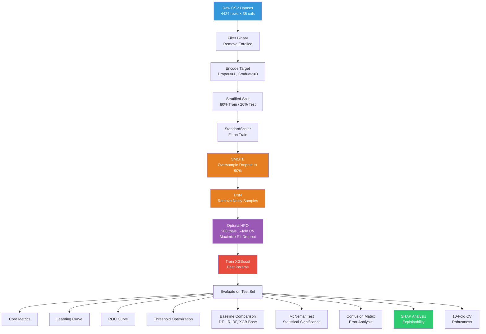

# PROJECT OVERVIEW — Student Dropout Prediction Pipeline

> **Title:** Early Student Dropout Prediction Using XGBoost, SMOTE-ENN, and SHAP Explainability
> **Version:** V3 (Binary Classification — Final)
> **Runtime:** Google Colab (Python 3.11.8)

---

## 1. Project Objective

This is an **academic research project** aimed at building an early warning system to identify higher-education students at risk of dropping out. The core research questions are:

| ID | Research Question |
|----|-------------------|
| **RQ1** | Can XGBoost combined with SMOTE-ENN outperform traditional ML algorithms in predicting student dropout? |
| **RQ2** | Is the performance improvement statistically significant compared to baseline models? |

The practical goal is **early intervention** — predicting dropout using demographic and academic data from semesters 1 & 2, enabling institutions to act before semester 3.

---

## 2. Repository Structure

```
riset/
├── README.md                          # Research context & development rules
├── PROJECT_OVERVIEW.md                # This file
├── data/
│   └── raw/
│       └── dataset (1).csv            # Raw dataset (~470 KB)
├── notebooks/
│   └── exploration.ipynb              # Complete pipeline (21 code cells, V3 Final)
└── src/
    ├── 01_data_preparation.py         # (empty — placeholder)
    ├── 02_preprocessing.py            # (empty — placeholder)
    ├── 03_smoteenn.py                 # (empty — placeholder)
    ├── 04_optuna_tuning.py            # (empty — placeholder)
    ├── 05_training.py                 # (empty — placeholder)
    ├── 06_evaluation.py               # (empty — placeholder)
    ├── 07_model_comparison.py         # (empty — placeholder)
    ├── 08_mcnemar.py                  # (empty — placeholder)
    ├── 09_shap_analysis.py            # (empty — placeholder)
    ├── 10_cross_validation.py         # (empty — placeholder)
    └── 11_summary.py                  # (empty — placeholder)
```

### Current State

> [!IMPORTANT]
> **All 11 `.py` files in `src/` are empty** (0 bytes each). The entire working pipeline currently lives in a single monolithic Colab notebook: `notebooks/exploration.ipynb` (21 code cells). The `src/` files appear to be placeholders for a planned refactoring into modular scripts.

---

## 3. Dataset

**Source:** UCI "Predict Students' Dropout and Academic Success" dataset (Higher Education)

| Property | Value |
|----------|-------|
| File | `data/raw/dataset (1).csv` |
| Size | ~470 KB |
| Total Features | 34 input columns + 1 target |
| Target Column | `Target` |
| Original Classes | `Dropout`, `Graduate`, `Enrolled` |
| Binary Filtering | `Enrolled` records **removed** (status not final) |
| Encoding | `Dropout → 1` (positive/minority), `Graduate → 0` (negative/majority) |

### Feature Categories (36 columns total)

| Category | Features | Examples |
|----------|----------|---------|
| **Demographic** | ~7 | `Marital status`, `Nacionality`, `Gender`, `Age at enrollment`, `International` |
| **Family Background** | ~4 | `Mother's qualification`, `Father's qualification`, `Mother's occupation`, `Father's occupation` |
| **Application Info** | ~3 | `Application mode`, `Application order`, `Course` |
| **Enrollment** | ~4 | `Daytime/evening attendance`, `Previous qualification`, `Displaced`, `Educational special needs` |
| **Financial** | ~3 | `Debtor`, `Tuition fees up to date`, `Scholarship holder` |
| **Academic — 1st Semester** | 6 | `Curricular units 1st sem (credited/enrolled/evaluations/approved/grade/without evaluations)` |
| **Academic — 2nd Semester** | 6 | `Curricular units 2nd sem (credited/enrolled/evaluations/approved/grade/without evaluations)` |
| **Macroeconomic** | 3 | `Unemployment rate`, `Inflation rate`, `GDP` |

---

## 4. Full Pipeline (14 Phases)

The pipeline is executed sequentially in `exploration.ipynb`. Below is a detailed breakdown of every phase.

### Phase 0 — Data Loading & Binary Filtering

```
Cell [3] in exploration.ipynb
```

- Load CSV from Google Drive path
- Report dimensions and check for missing values
- Display original 3-class distribution
- **Filter out** all `Enrolled` records (rationale: Enrolled = temporary status, not a final outcome)
- Keep only `Graduate` and `Dropout` → pure binary classification
- Visualize binary class distribution (bar chart + pie chart)
- Report imbalance ratio

---

### Phase 1 — Target Encoding

```
Cell [4] in exploration.ipynb
```

- Map `Dropout → 1` (positive class — the class to detect)
- Map `Graduate → 0` (negative class)
- Separate features `X` and target `y`
- Drop original `Target` and encoded `Target_enc` from feature matrix
- Report feature count and class distribution percentages

---

### Phase 2 — Stratified Train-Test Split

```
Cell [5] in exploration.ipynb
```

| Parameter | Value |
|-----------|-------|
| Test Size | 20% |
| Training Size | 80% |
| Stratification | Yes (preserves class proportions) |
| Random State | 42 |

---

### Phase 3 — Feature Scaling

```
Cell [6] in exploration.ipynb
```

- **Method:** `StandardScaler` (z-score normalization)
- Fit on training data only, transform both train and test
- Output preserved as DataFrames with original column names and indices
- Execution time recorded

---

### Phase 4 — Imbalanced Data Handling (SMOTE-ENN)

```
Cell [7] in exploration.ipynb
```

This is a **two-step resampling** approach applied only to training data:

| Step | Method | Purpose | Configuration |
|------|--------|---------|---------------|
| 1 | **SMOTE** | Oversample minority class (Dropout) | `k_neighbors=5`, target = 90% of majority count |
| 2 | **ENN** (Edited Nearest Neighbours) | Clean noisy/borderline samples | `n_neighbors=3`, `kind_sel='mode'` |

**Key design decisions:**
- Target ratio is 90% (not 100%) to avoid introducing too many synthetic samples
- SMOTE is applied first, then ENN removes noisy observations from both classes
- Binary classification makes ENN more effective (cleaner decision boundary with only 2 classes)
- Balance status is verified (≥80% ratio = acceptable)

---

### Phase 5 — Hyperparameter Optimization (Optuna)

```
Cell [8] in exploration.ipynb
```

| Setting | Value |
|---------|-------|
| Framework | Optuna |
| Sampler | TPE (Tree-structured Parzen Estimator), seed=42 |
| Pruner | MedianPruner (n_startup_trials=15, n_warmup_steps=5) |
| Trials | 200 |
| Timeout | 7200 seconds (2 hours) |
| Optimization Target | Maximize F1-Score for Dropout class (binary, pos_label=1) |
| CV Strategy | 5-fold StratifiedKFold |

**Hyperparameter Search Space:**

| Parameter | Range | Scale |
|-----------|-------|-------|
| `n_estimators` | 100 – 700 | linear |
| `max_depth` | 3 – 6 | linear |
| `learning_rate` | 0.005 – 0.3 | log |
| `subsample` | 0.5 – 1.0 | linear |
| `colsample_bytree` | 0.4 – 1.0 | linear |
| `colsample_bylevel` | 0.4 – 1.0 | linear |
| `colsample_bynode` | 0.4 – 1.0 | linear |
| `min_child_weight` | 5 – 30 | linear |
| `gamma` | 0.0 – 10.0 | linear |
| `max_delta_step` | 1 – 10 | linear |
| `reg_alpha` | 1.0 – 30.0 | log |
| `reg_lambda` | 1.0 – 30.0 | log |
| `scale_pos_weight` | 0.5 – 2.0 | linear |

**Fixed parameters:** `objective='binary:logistic'`, `eval_metric='logloss'`, `tree_method='hist'`

---

### Phase 6 — Model Training

```
Cell [9] in exploration.ipynb
```

- Instantiate `XGBClassifier` with best parameters from Optuna
- Train on **SMOTE-ENN resampled data** (`X_res`, `y_res`)
- Evaluation set: original scaled test data (`X_test_sc`, `y_test`)
- Verbose output disabled

---

### Phase 7 — Model Evaluation

```
Cells [10–13] in exploration.ipynb
```

#### 7.0 — Core Metrics

| Metric | Purpose |
|--------|---------|
| Accuracy | Overall correct predictions |
| Balanced Accuracy | Average recall per class (handles imbalance) |
| **F1-Score (Binary, Dropout)** | **Primary metric** — harmonic mean of precision & recall for Dropout |
| Precision (Dropout) | Proportion of predicted dropouts that are actual dropouts |
| Recall (Dropout) | Proportion of actual dropouts that are correctly identified |
| AUC-ROC | Discriminative ability across all thresholds |
| Cohen's Kappa | Agreement beyond chance |
| MCC (Matthews Correlation Coefficient) | Balanced measure for binary classification |

#### 7.1 — Learning Curve
- Plots training vs. validation F1 across increasing sample sizes
- Includes overfitting gap analysis (threshold = 0.10)

#### 7.2 — AUC-ROC Curve
- Full ROC curve visualization for the proposed model

#### 7.3 — Threshold Optimization
- Sweeps probability threshold from 0.05 to 0.95 (step 0.01)
- Plots F1, Recall, and Precision as a function of threshold
- Identifies optimal threshold that maximizes F1-Dropout
- Compares default (0.50) vs. optimal threshold performance

---

### Phase 8 — Baseline Model Comparison

```
Cell [14] in exploration.ipynb
```

Five models are compared on the **same test set**:

| # | Model | Training Data | Class Weighting |
|---|-------|---------------|-----------------|
| 1 | Decision Tree | Original (scaled) | `class_weight='balanced'` |
| 2 | Logistic Regression | Original (scaled) | `class_weight='balanced'`, max_iter=1000 |
| 3 | Random Forest | Original (scaled) | `class_weight='balanced'`, n_estimators=100 |
| 4 | XGBoost (Baseline) | Original (scaled) | Default (n_estimators=100, max_depth=6, lr=0.1) |
| 5 | **XGBoost + SMOTE-ENN (Proposed)** | SMOTE-ENN resampled | Optuna-tuned parameters |

**Visualizations produced:**
- Grouped bar chart comparing F1-Dropout, Recall, Precision, AUC-ROC, Balanced Accuracy
- Precision-Recall curve for all 5 models with Average Precision scores

---

### Phase 9 — Statistical Significance (McNemar Test)

```
Cell [15] in exploration.ipynb
```

- Pairwise McNemar test: Proposed model vs. each baseline
- Tests whether the difference in error patterns is statistically significant
- Significance level: α = 0.05
- Uses exact test when (b + c) < 25, chi-squared approximation otherwise
- Directly answers **RQ2**

---

### Phase 10 — Error Analysis (Confusion Matrix)

```
Cell [16] in exploration.ipynb
```

- Dual confusion matrix: absolute counts + normalized proportions
- Detailed TP/FP/FN/TN breakdown with interpretations
- Manual recalculation of Precision, Recall, F1 from confusion matrix values

---

### Phase 11 — Explainability (SHAP)

```
Cell [17] in exploration.ipynb
```

Using `shap.TreeExplainer` for the final XGBoost model:

| Analysis | Type | Purpose |
|----------|------|---------|
| **Beeswarm Plot** | Global | Feature influence distribution across all test samples |
| **Bar Chart** | Global | Mean absolute SHAP value per feature (top 15) |
| **Top 10 Table** | Global | Mean |SHAP|, mean direction, and interpretation |
| **Dependence Plots** | Semi-local | Top 3 features: SHAP value vs. feature value with interaction coloring |
| **Waterfall (Dropout)** | Individual | Explains a single correctly-predicted Dropout instance |
| **Waterfall (Graduate)** | Individual | Explains a single correctly-predicted Graduate instance |

**Interpretation convention:** SHAP > 0 = increases dropout risk, SHAP < 0 = decreases dropout risk.

---

### Phase 12 — Robustness Validation (10-Fold CV)

```
Cell [18] in exploration.ipynb
```

- 10-fold StratifiedKFold cross-validation on resampled data
- Re-trains from scratch in each fold using best Optuna parameters
- Metrics: F1-Dropout, AUC-ROC, Balanced Accuracy, MCC
- Reports mean ± std, min, max per metric

---

### Phase 13 — Computational Efficiency

```
Cell [19] in exploration.ipynb
```

- Tracks execution time for every phase via `catat_waktu()` utility
- Produces summary table: phase name, seconds, minutes
- Total pipeline execution time

---

### Phase 14 — Research Summary

```
Cell [20] in exploration.ipynb
```

- Answers RQ1: delta between Proposed vs. Baseline for all metrics
- Answers RQ2: McNemar p-values and significance conclusions
- Reports optimal threshold and its impact
- Lists top 5 SHAP features with their influence direction
- Summarizes early warning context and practical implications
- Lists all generated PDF output files

---

## 5. Key Libraries & Dependencies

| Library | Version | Purpose |
|---------|---------|---------|
| `xgboost` | — | Primary classifier (XGBClassifier) |
| `optuna` | — | Bayesian hyperparameter optimization |
| `shap` | — | Model explainability (TreeExplainer) |
| `imbalanced-learn` | — | SMOTE and ENN resampling |
| `scikit-learn` | — | Preprocessing, metrics, CV, baselines |
| `statsmodels` | — | McNemar statistical test |
| `pandas` / `numpy` | — | Data manipulation |
| `matplotlib` / `seaborn` | — | Visualization |

---

## 6. Output Artifacts (PDF Figures)

| File | Content |
|------|---------|
| `v3_distribusi_binary.pdf` | Binary class distribution (bar + pie) |
| `v3_learning_curve.pdf` | Training vs. validation F1 + overfitting gap |
| `v3_roc_curve.pdf` | AUC-ROC curve |
| `v3_threshold_optimization.pdf` | F1/Recall/Precision vs. threshold |
| `v3_perbandingan_metrik.pdf` | 5-model metric comparison bar chart |
| `v3_precision_recall_curve.pdf` | PR curves for all models |
| `v3_confusion_matrix.pdf` | Confusion matrix (counts + proportions) |
| `v3_shap_beeswarm.pdf` | SHAP beeswarm plot |
| `v3_shap_global_bar.pdf` | SHAP global feature importance |
| `v3_shap_dep_*.pdf` | SHAP dependence plots (top 3 features) |
| `v3_shap_waterfall_dropout.pdf` | Individual SHAP explanation (Dropout) |
| `v3_shap_waterfall_graduate.pdf` | Individual SHAP explanation (Graduate) |

---

## 7. Architecture Diagram



---

## 8. Critical Constraints (from README)

1. **Do not** change research objectives or target encoding
2. **Maintain** binary classification setting (no multiclass)
3. **Preserve** SMOTE-ENN preprocessing pipeline
4. **Preserve** SHAP explainability pipeline and compatibility
5. **Preserve** statistical testing procedures (McNemar)
6. **Prioritize** reproducibility and academic validity
7. All major code changes must be explained before implementation
8. Random seed `SEED = 42` used throughout for reproducibility

---

## 9. Current Gaps & Observations

> [!WARNING]
> The following items are observations about the current state — not recommendations for changes.

| # | Observation |
|---|-------------|
| 1 | All `src/*.py` files are empty (0 bytes). The full pipeline runs only from `exploration.ipynb`. |
| 2 | The notebook uses a Google Drive path (`/content/drive/MyDrive/XGBOOST-DO/Colab/dataset.csv`) which differs from the local data path (`data/raw/dataset (1).csv`). |
| 3 | No `requirements.txt` or environment specification file exists. |
| 4 | The notebook has no markdown cells — all 21 cells are code with inline comments (in Indonesian). |
| 5 | No saved model artifacts (`.pkl`, `.joblib`) — the model exists only in notebook memory during execution. |
| 6 | Cross-validation (Phase 12) runs on resampled data rather than applying SMOTE-ENN inside each fold, which could introduce data leakage. |
| 7 | PDF outputs are saved to the Colab working directory, not to a structured `outputs/` folder. |
